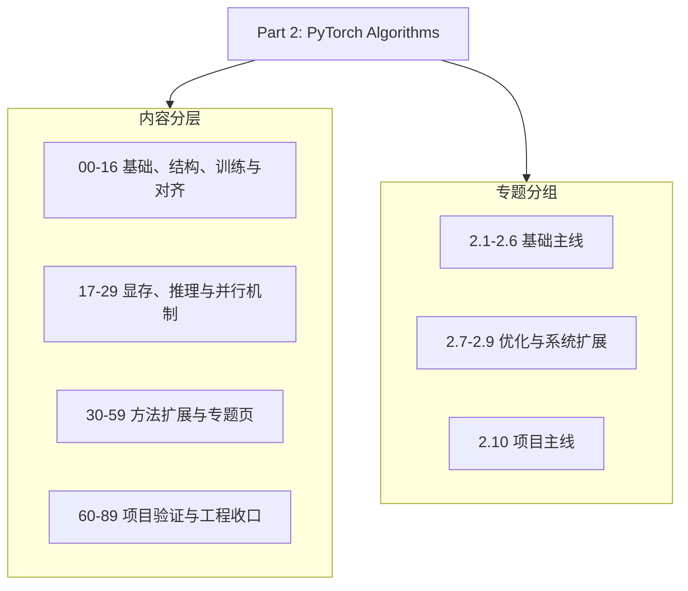

# Part 02: PyTorch Algorithm Practice | 第二部分：PyTorch 算法实战

## Part Overview | Part 概览

本部分聚焦 PyTorch 级别的大模型实现，位于 Part 0 / Part 1 之后、Part 3 之前，负责把算子、模型结构、训练、对齐、显存、推理、并行和项目验证连接成一条工程实现链。正文默认 notebook-first，组页负责组内阅读顺序，Part 级导学只说明整体结构和入口。

Part 02 按 10 个专题组组织：`2.1-2.6` 建立基础算子、模型、训练、显存和推理直觉，`2.7-2.9` 扩展到推理策略、量化、通信与并行，`2.10` 负责项目验证和工程收口。具体章节状态和逐节资产由组页与维护文档负责。



## Part 02、Part 03、Part 04 的分工

这是理解 89 个文件是否合理的核心框架。

| Part | 名称 | 核心问题 | 抽象层级 | 受众 |
|:---|:---|:---|:---|:---|
| Part 00 | Prerequisites | "Python/PyTorch 怎么用？" | 语言/框架基础 | 所有人 |
| Part 01 | Hardware, Math & Systems | "硬件上发生了什么？" | 硬件/系统原理 | 系统工程师 |
| Part 02 | PyTorch Algorithms | "算法怎么用代码表达？" | 算法实现 | 算法/工程开发 |
| Part 03 | Triton Kernels | "算子怎么写得更快？" | 高性能算子 | 系统/性能工程师 |
| Part 04 | CUDA & System Optimization | "系统怎么极致优化？" | 极致系统优化 | 系统工程师 |

### 关键边界

```text
Part 02（算法实现）：回答 "这个算法在 PyTorch 里怎么写？"
    ↓ 当 PyTorch 不够快时
Part 03（Triton 算子）：回答 "这个算子怎么用 Triton 写得更快？"
    ↓ 当 Triton 不够底层 / 需要极致优化时
Part 04（CUDA / 系统）：回答 "这个系统怎么在 CUDA 层面做极致优化？"
```

## Part Asset Overview | Part 资产总览

本章内容按 10 个主题组组织，后续页面也沿该结构继续扩展。

> 导航说明：先看总览，再进入具体组页。
> 组页负责组内阅读顺序与资产收口，不需要一次性读完全部页面。
> Part 2 既是工程实战目录，也是 Part 0 / Part 1 之后、Part 3 之前的共同衔接层。

| 学习组 | 职责作用 | 入口与代表内容 | 规模 |
|:---|:---|:---|:---|
| [2.1](./2_1.md) | 建立基础算子和组件直觉 | 00-04：基础算子、Attention | 5 |
| [2.2](./2_2.md) | 组装模型结构并理解 MoE 组件 | 05-08：Block、MoE、结构技巧 | 4 |
| [2.3](./2_3.md) | 立住 SFT、LoRA 和训练更新闭环 | 09-13：训练与微调 | 5 |
| [2.4](./2_4.md) | 理解偏好优化与对齐链路 | 14-16：PPO、DPO、GRPO | 3 |
| [2.5](./2_5.md) | 理解反向传播与训练侧显存优化 | 17-19：Autograd、激活与 checkpoint | 3 |
| [2.6](./2_6.md) | 建立推理加速和缓存直觉 | 20-22：Attention、解码、PagedAttention | 3 |
| [2.7](./2_7.md) | 深入 serving、cache 和调度 | 23-24 + 34-39：推理进阶 | 8 |
| [2.8](./2_8.md) | 理解模型压缩与量化 | 25-26 + 40-45：量化与压缩 | 8 |
| [2.9](./2_9.md) | 建立通信和并行策略判断 | 27-29 + 46-49：并行与通信 | 7 |
| [2.10](./2_10.md) | 用项目验证前面的机制与方法 | 60-89：训练、推理、显存、并行和对齐项目 | 30 |

## Learning Path | 学习路径

Part 2 可以按多条入口理解：零基础入口先把算子、组装、训练与项目闭环串起来；训练优先、推理优先和并行优先入口则可以从不同工程目标切入，最后都回到项目实战。

### Recommended Order | 推荐顺序

- 零基础入口：先看 [2.1](./2_1.md) -> [2.2](./2_2.md) -> [2.3](./2_3.md) -> [2.5](./2_5.md) -> [2.10](./2_10.md)
- 训练优先入口：先看 [2.3](./2_3.md) -> [2.4](./2_4.md) -> [2.5](./2_5.md) -> [2.10](./2_10.md)
- 对齐优先入口：先看 [2.3](./2_3.md) -> [2.4](./2_4.md) -> [2.10](./2_10.md)
- 推理优先入口：先看 [2.6](./2_6.md) -> [2.7](./2_7.md) -> [2.8](./2_8.md)；如果继续走系统与分布式链路，再进入 [2.9](./2_9.md) -> [2.10](./2_10.md)
- 并行优先入口：先看 [2.9](./2_9.md) -> [2.10](./2_10.md)
- 系统学习：按 [2.1](./2_1.md) -> [2.2](./2_2.md) -> [2.3](./2_3.md) -> [2.4](./2_4.md) -> [2.5](./2_5.md) -> [2.6](./2_6.md) -> [2.7](./2_7.md) -> [2.8](./2_8.md) -> [2.9](./2_9.md) -> [2.10](./2_10.md) 顺序推进

### Next Steps | 后续衔接

- 基础认知层：先看 [2.1](./2_1.md)、[2.2](./2_2.md)，把基础算子和模型组装先立住，再按需要进入 [2.5](./2_5.md)。
- 训练与对齐层：先看 [2.3](./2_3.md)、[2.4](./2_4.md)、[2.5](./2_5.md)，把训练、对齐和显存优化的链路理顺，主要衔接后续实现页和项目页。
- 推理与并行层：先看 [2.6](./2_6.md)、[2.7](./2_7.md)、[2.8](./2_8.md)、[2.9](./2_9.md)，把推理、压缩和并行策略串起来，主要衔接项目实战与后续实现页。
- 项目收口：最后看 [2.10](./2_10.md)，把前面的知识点放回真实项目里验证和收束。

## Environment Notes | 环境说明

- 整体学习路径默认按 `CPU-first` 组织，优先保证概念理解、逻辑验证和最小 correctness。
- 这里只写 Part 级统一前提，不点到具体节号。
- 少数进阶 notebook 会把 GPU、多卡或完整工具链作为扩展验证条件；若存在这类要求，以单页说明为准，不在导学页重复展开。

Part 02 的运行环境分为三层：

| 环境层 | 适用内容 | 学习者需要准备什么 |
|:---|:---|:---|
| CPU-first | 概念、答案测试和大多数 Notebook | Python、PyTorch CPU 依赖 |
| GPU PyTorch | 真实训练、显存和 CUDA 测量 | NVIDIA GPU、匹配驱动、CUDA 版 PyTorch、Transformers |
| GPU serving | 真实推理后端和吞吐测试 | GPU PyTorch 环境，以及与当前 CUDA / 驱动匹配的 vLLM |

在 Colab 或 ModelScope Notebook 中，默认把所有依赖安装在当前 runtime，不要求学习者创建多个 Conda 环境。只有本地机器同时维护多个 CUDA / vLLM 版本时，才通过单节配置中的环境名选择独立 vLLM 环境。具体依赖安装命令和版本约束由需要该环境的 Notebook 单独说明。

因此，学习者的默认路径是“一个 runtime / 一个虚拟环境”。本地多环境只是 vLLM 与 PyTorch 依赖冲突时的可选兜底，不是开始学习前必须搭建的两套环境。

### 真实模型与 GPU 实验的统一约定

Part 02 中需要真实模型或真实 GPU 的项目，采用“统一下载、缓存复用、按节启用”的工作流：

- 模型默认使用 `MODEL_SOURCE = "auto"`，优先复用本地模型目录；本地没有时再从 Hugging Face 或 ModelScope 下载。
- 模型统一缓存到项目根目录的 `model_cache/`，同一个模型只下载一次，训练、推理和显存实验共享同一份权重。
- 已有本地模型时可设置 `MODEL_SOURCE = "local"`，并把 `MODEL_ID` 改为模型目录；网络受限时可显式使用 `MODEL_SOURCE = "modelscope"`。
- 真实实验默认关闭，不影响 CPU-first 的答案测试；只有学习者确认 GPU、驱动、PyTorch 和对应运行时可用后，才打开单节中的真实实验开关。
- 本地、Colab 和 ModelScope Notebook 均应把仓库或持久化目录作为工作目录；实验结果统一保存到 `benchmarks/results/`，避免重启会话后丢失。
- Part 级 Intro 只规定这套工作流；模型大小、数据类型、序列长度、端口和显存阈值由具体 notebook 的环境说明负责。

最小准备流程如下：

```python
MODEL_SOURCE = "auto"       # auto / huggingface / modelscope / local
MODEL_CACHE_DIR = "model_cache"
```

首次运行会下载模型，后续项目直接复用缓存。Colab 或 ModelScope 中如果使用临时磁盘，应将 `MODEL_CACHE_DIR` 和 `benchmarks/results/` 指向持久化目录。
