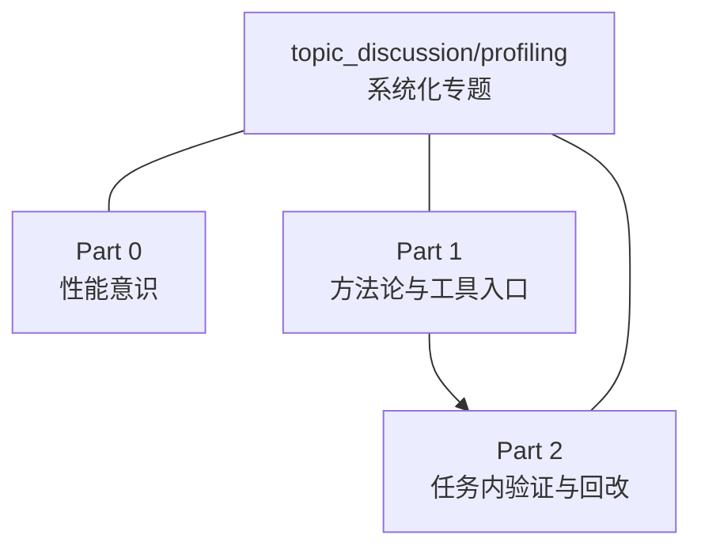

# Profiling 专题

## 专题概览
本专题用于沉淀贯穿 Part 1-2 的性能意识、profiling 方法和瓶颈定位经验。
Profiling 之所以重要，是因为大模型训练和推理中的很多瓶颈并不是“代码写错了”，而是算子、通信、显存和调度之间的真实系统代价没有被看见。没有 profiling，就很难判断优化应该先从哪里入手，也很难判断一次改动到底是提升还是退化。
`Part 0E` 是这条线的前置桥，它把调试、显存和性能判断先收一遍，适合在进入专题前先快速过一遍。

## 职责边界

这个专题和 `Part 0-4` 是两条正交的线：

- `Part` 线负责按章节推进学习深度，解决“这一阶段应该学什么”。
- `topic_discussion/profiling` 线负责把 profiling 这件事做深做透，解决“应该怎么看、怎么测、怎么判断、怎么回改”。

更具体地说：

- `Part 1` 放 profiling 方法论和工具入口。
- `Part 2` 放把 profiling 嵌进真实任务后的验证和回改。

## 对应来源

| 来源 | 适合纳入的内容 |
|:---|:---|
| `Part 0E` | 调试、显存和性能判断的前置桥 |
| `Part 1A / 1B / 1C / 1D / 1E` | profiling 方法论、工具入口、显存 / 通信 / 调度 / 编译的观测基础 |
| `Part 2` | 训练 / 推理 / 显存相关任务里的验证、回改和复测 |

## Part 1 相关前置

- [1A](../../01_Hardware_Math_and_Systems/1A.md)：先看数量级与资源账本，知道 profiling 结果应该怎么和规模估算对齐。
- [1B](../../01_Hardware_Math_and_Systems/1B.md)：先看单卡硬件和访存路径，知道显存和带宽瓶颈从哪里来。
- [1C](../../01_Hardware_Math_and_Systems/1C.md)：先看多卡通信和显存共享，知道什么时候 profiling 要盯通信等待。
- [1D](../../01_Hardware_Math_and_Systems/1D.md)：先看执行模型和调度边界，知道 stream、kernel 和 runtime 行为怎么被观测。
- [1E](../../01_Hardware_Math_and_Systems/1E.md)：先看图优化和后端成本模型，知道 profiling 结果如何回到 backend 视角。

## 章节跳转

| 章节 | 你会看到什么 | 跳转 |
|:---|:---|:---|
| `Part 1` | profiling 的方法入口和工具分层 | [Part 1 导读](../01_Hardware_Math_and_Systems/intro.md) |
| `0E` | 调试与性能的前置桥，先把观测和排错习惯立住 | [0E 调试与性能](../../00_Prerequisites/0E.md) |
| `0E-17` | profiling 的基础入口和瓶颈定位 | [17 PyTorch Profiling Basics](../../00_Prerequisites/17_PyTorch_Profiling_Basics.md) |
| `0E-18` | 显存账本与优化手段 | [18 Memory Profiling and Optimization](../../00_Prerequisites/18_Memory_Profiling_and_Optimization.md) |
| `0E-19` | 最小排错和异常定位 | [19 Debugging and Anomaly Localization](../../00_Prerequisites/19_Debugging_and_Anomaly_Localization.md) |
| `0E-20` | 性能判断和优化决策 | [20 Profiling and Memory Ledger](../../00_Prerequisites/20_Profiling_and_Memory_Ledger.md) |
| `2.5` | 反向传播、激活重计算、显存卸载的验证入口 | [2.5 反向传播与显存优化](../../02_PyTorch_Algorithms/2_5.md) |
| `19` | checkpointing / offload 的显存收益与 trade-off | [19 Activation Checkpointing and Activation Offload](../../02_PyTorch_Algorithms/19_Activation_Checkpointing_and_Activation_Offload.md) |
| `2.6` | FlashAttention、decode 和 PagedAttention 的推理侧观察点 | [2.6 核心推理优化](../../02_PyTorch_Algorithms/2_6.md) |
| `20-22` | 推理侧 benchmark、缓存增长和系统行为 | [20 FlashAttention Sim](../../02_PyTorch_Algorithms/20_FlashAttention_Sim.md) / [21 Decoding Strategies](../../02_PyTorch_Algorithms/21_Decoding_Strategies.md) / [22 vLLM PagedAttention](../../02_PyTorch_Algorithms/22_vLLM_PagedAttention.md) |
| `2.8` | 多卡并行与通信边界的观测入口 | [2.8 分布式并行策略](../../02_PyTorch_Algorithms/2_8.md) |
| `74-79-46` | 端到端 profiling、分布式基准与通信热点分析 | [74 Profiling Driven End-to-End Optimization](../../02_PyTorch_Algorithms/74_Profiling_Driven_End_to_End_Optimization.md) / [79 Distributed Parallel Benchmark](../../02_PyTorch_Algorithms/79_Distributed_Parallel_Benchmark.md) / [46 Communication Profiling with NCCL](../../02_PyTorch_Algorithms/46_Communication_Profiling_with_NCCL.md) |

## 专题内容
- Part 1：profiling 方法入门和工具分层
- Part 2：训练 / 推理 / 显存验证中的收益证明

## 推荐入口

- 先看 `Part 1`，建立 profiling 的方法论和工具入口。
- 再看 `Part 2`，把 profiling 放进真实任务里验证收益。
- 如果想看更深的工具读法、案例拆解和系统化方法，再回到本专题继续补充。

## 入口摘要

- 第一入口：`Part 1` + `0E -> 17 -> 18 -> 19 -> 20`，先把观测、排错和性能判断立住。
- 第二入口：`2.5 -> 2.6 -> 2.8`，把训练、推理和并行里的 profiling 现象看清楚。
- 验证入口：`74 -> 79 -> 46 -> 2.9`，把端到端优化、分布式基准和通信热点收进闭环。

## 正文页

- [Profiling 正文](./casebook.md)：按“时间 / 显存 / 瓶颈 / 通信 / 验证”展开正文，适合做更细的诊断方法和案例拆解。
- [Profiling 深入阅读](./walkthrough.md)：按完整排障故事展开，适合想看连续推演的人。

## 相关专题

- [推理优化专题](../inference_optimization/intro.md)：当你要把 profiling 结果落到 attention、decode 和 cache 路径时先看这里。
- [通信与并行专题](../communication_parallel/intro.md)：当瓶颈出现在多卡同步、等待和 overlap 时先看这里。
- [显存优化与性能调优专题](../memory_performance_tuning/intro.md)：当问题集中在 VRAM、activation 或 KV cache 时先看这里。
- [编译与图优化专题](../compiler_graph_optimization/intro.md)：当你想从图级、执行级或 backend 级解释性能差异时先看这里。

## Part 1 / Part 2 入口顺序

### Part 1 入口

- 先补 `0E -> 17 -> 18 -> 19 -> 20`，把调试、显存、排错和性能判断的前置桥补齐。
- 再从 `Part 1` 导读进入 `profiling` 方法论和工具入口，建立统一的观测框架。

### Part 2 入口

- 先看 `2.5 -> 19`，把训练侧反向传播和 checkpointing 的显存收益看清楚。
- 再看 `2.6 -> 20-22`，把推理侧 attention、解码和 cache 行为看清楚。
- 然后看 `2.8 -> 74-79-46`，把多卡并行、分布式 benchmark 和通信热点串起来。
- 最后看 `2.9`，把 profiling 结论收进项目验证闭环。

## 读法建议

- 如果你还没看 `0E`，可以先把它当成专题前置桥补一下。
- 如果你想先补前置桥，可以按 `0E -> 17 -> 18 -> 19 -> 20` 这条线过一遍。
- 先用 `Part 1` 建立“怎么看”的框架。
- 再用 `2.5` 和 `2.6` 观察训练与推理中的性能现象。
- 最后回到 `74 / 79 / 46`，把方法沉到可复用的优化闭环里。

## 建设方式

- 入口页只负责告诉读者从哪进、怎么选路径、怎么回到 Part。
- 具体的采集、归因、验证和工具读法都放到正文页展开。
- 后续新增内容优先沿着 `17 / 20 / 13 / 74 / 79 / 46` 回收。

## 专题状态
当前为专题入口页，后续将逐步补充更完整的跨 Part 索引、工具读法和案例拆解。
